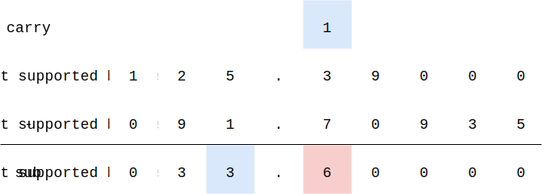
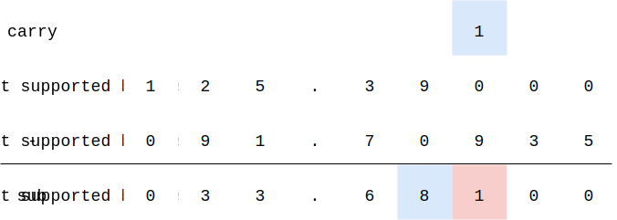
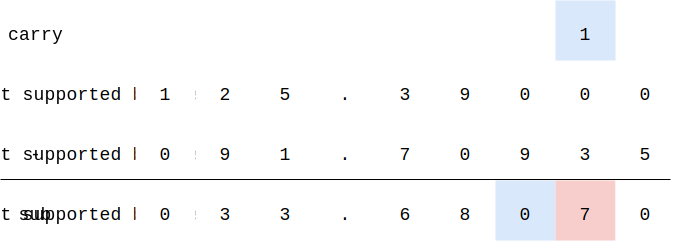

# LargeNumber - 大数字

--------

#### 问题

计算两个数字$$ a $$和$$ b $$的加减乘除，这些数字非常大，无法用编程语言中内置的$$ int64 $$、$$ float64 $$等类型来存储。

#### 解法

对每个数字设置符号、整数区、小数区三个部分，模拟小学数学中的加减乘除运算过程，得到结果。

#### 取反

如果$$ a \eq 0 $$，$$ a $$的负值为它自己，如果$$ a \ne 0 $$，$$ a $$的负值为$$ -a $$。

#### 加法

数字$$ a + b $$，有两种情况：

$$ (1) $$相同符号：可以把数字部分直接进行相加；

$$ (2) $$不同符号：比如$$ 12 + (-4) $$，可以转化为减法$$ 12 - 4 $$来计算，因此只需要考虑符号相同的两个数字相加；

对于$$ a + b = c $$，从低位开始依次计算：

$$

c[i] = ( c[i] + a[i] + b[i] ) % 10 \\
c[i+1] = c[i+1] + ( c[i] + a[i] + b[i] ) / 10

$$

下面演示$$ -125.39 + (-91.70935) = -217.09935 $$：

$$ (1) $$ 最后四个小数位相加没有进位，可以直接相加，得$$ 9935 $$；

$$ (2) $$ 十分位（小数点后第一位）$$ 3 + 7 $$进$$ 1 $$位，得$$ 0 $$；

$$ (3) $$ 个位$$ 5 + 1 + 1 $$（包含进位$$ 1 $$），得$$ 7 $$；

$$ (4) $$ 十位$$ 2 + 9 $$进$$ 1 $$位，得$$ 1 $$；

$$ (5) $$ 百位$$ 1 + 0 + 1 $$（包含进位$$ 1 $$），得$$ 2 $$。两个数字的千位都为$$ 0 $$，且没有进位，算法结束；

#### 减法

数字$$ a - b $$，有两种情况：

$$ (1) $$ $$ a $$和$$ b $$正负不同：比如$$ 12 - (-4) $$和$$ -12 - 4$$，可以转化为加法$$ 12 + 4 $$和$$ -12 + (-4) $$来计算；

$$ (2) $$ $$ a $$和$$ b $$正负相同且$$ a \lt b $$：比如$$ 1 - 14 $$可以转化为$$ -(14 - 1) $$；

$$ (3) $$ $$ a $$和$$ b $$正负相同且$$ a \ge b $$：直接计算$$ a - b $$；

对于$$ a - b = c $$（其中$$ a \ge b $$），从高位开始依次计算：

$$

c[i] =
\begin{cases}
a[i] - b[i] & a[i] \ge b[i] \\
a[i] + 10 - b[i], c[i+1] = c[i+1] - 1 & a[i] \lt b[i]
\end{cases}

$$

下面演示$$ 125.39 - 91.70935 = 33.68065 $$：

$$ (1) $$ 百位$$ 1 - 0 $$，得$$ 1 $$；

$$ (2) $$ 十位$$ 2 \lt 9 $$，从百位借$$ 1 $$有$$ 10 + 2 - 9 $$得$$ 3 $$，百位变为$$ 0 $$；

$$ (3) $$ 个位$$ 5 \ge 1 $$，得$$ 4 $$；

$$ (4) $$ 十分位$$ 3 \lt 7 $$，从个位借$$ 1 $$有$$ 3 + 10 - 7 $$得$$ 6 $$，个位变为$$ 3 $$；

$$ (5) $$ 百分位$$ 9 - 0 $$得$$ 9 $$；

$$ (5) $$ 千分位$$ 0 \lt 9 $$，从百分位借$$ 1 $$有$$ 10 + 0 - 9 $$得$$ 1 $$，百分位变为$$ 8 $$；

$$ (5) $$ 万分位$$ 0 \lt 3 $$，从千分位借$$ 1 $$有$$ 10 + 0 - 3 $$得$$ 7 $$，千分位变为$$ 0 $$；

$$ (5) $$ 亿分位$$ 0 \lt 5 $$，从万分位借$$ 1 $$有$$ 10 + 0 - 5 $$得$$ 5 $$，万分位变为$$ 6 $$；

#### 乘法

数字$$ a \times b $$，把数字部分直接进行相乘，最终正负相同则结果为正，正负不同则结果为负。

对于$$ a \times b = c $$，从低位开始依次计算：

$$

c[i] = ( c[i] + a[i] \times b[i] ) % 10 \\
c[i+1] = c[i+1] + ( c[i] + a[i] \times b[i] ) / 10

$$

演示$$ -125.39 * 91.70935 = -11499.4353965 $$我们会在后面补上

#### 除法

数字$$ a \div b $$，除法的模拟有些麻烦，我们会在后面补上

--------

#### 源码

[import, lang:"c_cpp"](../../../src/Calculation/LargeNumber.hpp)

#### 测试

[import, lang:"c_cpp"](../../../src/Calculation/LargeNumber.cpp)
