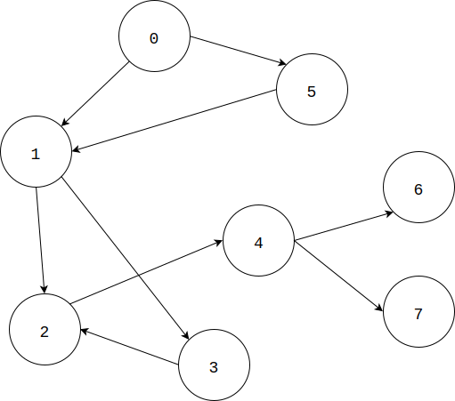

# Topological Sort - 拓扑排序

--------

#### 问题

对有向图$$ G $$进行拓扑排序。

#### 解法

拓扑排序可以通过应用深度优先搜索来解决。

对于有向图$$ G $$中的每个节点$$ i $$，都进行一次深度优先搜索，由于DFS的特性，每递归一次都尝试让节点$$ i $$走的更远，直到终点。因此从节点$$ i $$出发DFS所经过的节点数量可看作是节点$$ i $$到终点的距离$$ d $$。然后按照距离$$ d $$对所有节点进行排序即可得到拓扑排序。其中将终点到自己的距离作为$$ 1 $$。

下面以有向图$$ G $$作为一个例子进行拓扑排序：

从节点$$ 4 $$开始可以遍历到$$ 6 $$个节点，从节点$$ 3 $$开始可以遍历到$$ 5 $$个节点：

对图中的所有节点依次进行DFS，节点$$ 0 - 7 $$到终点的距离依次为$$ 8, 6, 3, 4, 2, 7, 1, 1 $$。因此按照距离排序后，有向图G的拓扑排序为[0, 5, 1, 3, 2, 4, 6, 7]。

拓扑先序遍历的时间复杂度是$$ O(n) $$。

--------

#### 源码

[import, lang:"c_cpp"](../../../../src/GraphTheory/Traverse/TopologicalSort.hpp)

#### 测试

[import, lang:"c_cpp"](../../../../src/GraphTheory/Traverse/TopologicalSort.cpp)
