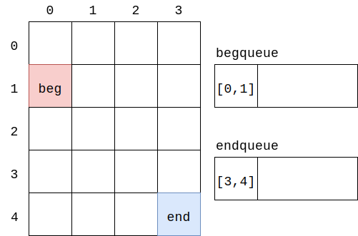
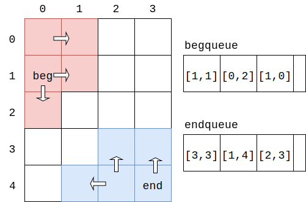
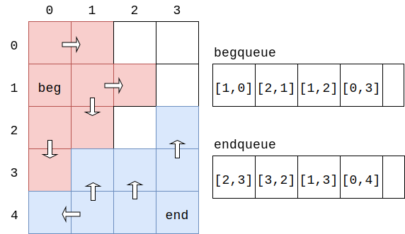

* [Upper Folder - 上一级目录](../)

--------

### Bidirectional Breadth Search
### 双向广度搜索

#### 问题

在$$ m \times n $$的二维方格图$$ s $$中用双向广度搜索从$$ beg $$点移动到$$ end $$点。

#### 解法

双向广度优先搜索是在广度优先搜索基础上的一个变种，搜索速度更快。该算法从$$ beg $$和$$ end $$两个点开始，同时进行广度优先搜索，两边的点在某一处相遇，即可得到一条从$$ beg $$到$$ end $$的路径。

初始时将$$ beg $$和$$ end $$分别加入两个队列$$ begqueue $$和$$ endqueue $$中。每次分别从$$ begqueue $$和$$ endqueue $$队列中取出节点$$ x $$和$$ y $$进行访问，在节点加入$$ begqueue $$之前将其染成红色，加入$$ endqueue $$之前其染成绿色。若$$ x $$取出后发现已被染成绿色，说明$$ x $$被$$ endqueue $$访问过，或$$ y $$取出后发现其已被染成红色，说明$$ y $$被$$ begqueue $$访问过。说明两个队列在此处相遇，算法结束。

在下面这个\(m = 4\)，\(n = 5\)的二维方格\(s\)中，从\(beg = [0,1]\)移动到\(end = [3,4]\)的过程如下：

$$ (1) $$初始时，将$$ beg = [0,1] $$染红并加入$$ begqueue $$中，将$$ end = [3,4] $$染绿并加入$$ endqueue $$；

$$ (2) $$从$$ begqueue $$中取出头节点$$ [0,1] $$，将其四周未被染色的邻节点$$ [0,0] $$、$$ [1,1] $$、$$ [0,2] $$染红并加入$$ begqueue $$中。从$$ endqueue $$中取出头节点$$ [3,4] $$，将其四周未被染色的邻节点$$ [2,4] $$、$$ [3,3] $$染红并加入$$ endqueue $$中；

$$ (3) $$从$$ begqueue $$中取出头节点$$ [0,0] $$，将其四周未被染色的邻节点$$ [1,0] $$染红并加入$$ begqueue $$中。从$$ endqueue $$中取出头节点$$ [2,4] $$，将其四周未被染色的邻节点$$ [1,4] $$、$$ [2,3] $$染红并加入$$ endqueue $$中；

$$ (4) $$从$$ begqueue $$中取出头节点$$ [1,1] $$，将其四周未被染色的邻节点$$ [2,1] $$、$$ [1,2] $$染红并加入$$ begqueue $$中。从$$ endqueue $$中取出头节点$$ [3,3] $$，将其四周未被染色的邻节点$$ [3,2] $$染红并加入$$ endqueue $$中；

$$ (5) $$从$$ begqueue $$中取出头节点$$ [0,2] $$，将其四周未被染色的邻节点$$ [0,3] $$染红并加入$$ begqueue $$中。从$$ endqueue $$中取出头节点$$ [1,4] $$，将其四周未被染色的邻节点$$ [1,3] $$、$$ [0,4] $$染红并加入$$ endqueue $$中； 

\((6)\)从\(begqueue\)中取出头节点\([1,0]\)，将其四周未被染色的邻节点\([2,0]\)染红并加入\(begqueue\)中。从\(endqueue\)中取出头节点\([2,3]\)，将其四周未被染色的邻节点\([2,2]\)染红并加入\(endqueue\)中； 

\((7)\)从\(begqueue\)中取出头节点\([2,1]\)，将其邻节点\([2,2]\)已经被染绿，说明该节点已经被加入\(endqueue\)中，或已经被\(endqueue\)访问过了。因此\([2,2]\)为\(begqueue\)和\(endqueue\)相遇的位置，算法结束； 

对于二维方格\(s\)，广度优先搜索从\(beg\)点遍历到\(end\)点的过程一般是从\(beg\)向四周发散开，一直到达\(end\)点： 

而双向广度优先搜索则是从\(beg\)和\(end\)两个点分别发散开，在中间相遇： 

双向广度搜索的时间复杂度与广度优先搜索一样，也是\(O(m \times n)\)。 

--------

#### 源码

[import, lang:"c_cpp"](../../../src/Search/BidirectionalBreadthSearch.hpp)

#### 测试

[import, lang:"c_cpp"](../../../src/Search/BidirectionalBreadthSearch.cpp)
