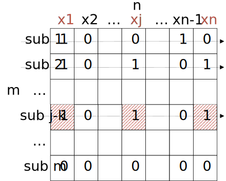
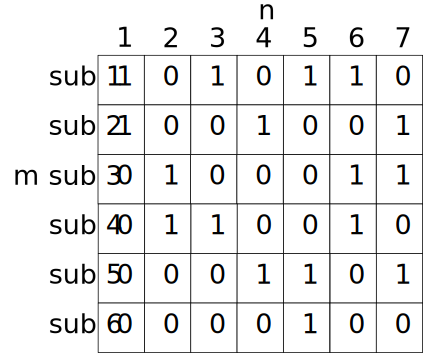
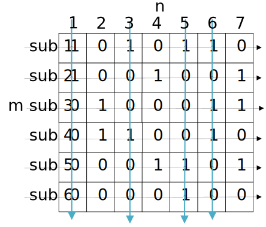
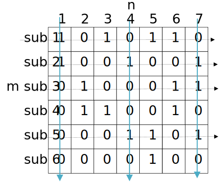
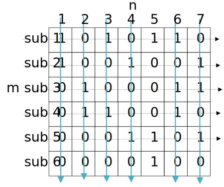
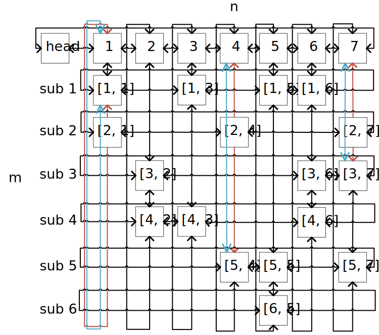
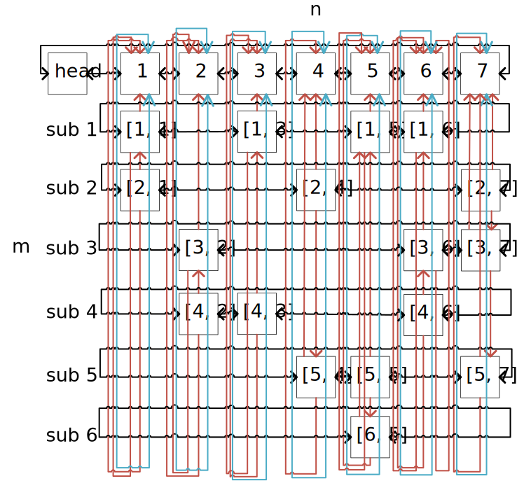

# Dancing Links - 舞蹈链

--------

#### 问题

集合$$ s = \{ x_1,x_2, \cdots ,x_n \} $$拥有$$ n $$个成员，现在集合$$ s $$有$$ m $$个子集$$ \{ sub_1,sub_2, \cdots ,sub_m \} $$。在$$ m $$个子集中选择一些组成集合$$ t = \{ sub_1,sub_2, \cdots \} $$，使$$ t $$中包含的成员可以覆盖集合$$ s $$，即$$ s $$中所有成员都属于$$ t $$中的某个或某些子集。

重复覆盖：集合$$ s $$中的任意成员$$ \forall x \in t $$（允许同时属于两个以上的子集）。例如集合$$ s = \{ 0,1,2,3 \} $$，在子集$$ sub_1 = \{ 0,1 \} $$、$$ sub_2 = \{ 1,2 \} $$、$$ sub_3 = \{ 1,3 \} $$中选择$$ t = \{ sub_1,sub_2,sub_3 \} $$即可重复覆盖$$ s $$。

精确覆盖：集合$$ s $$中的任意成员$$ x $$属于且只属于$$ t $$中的一个子集，不能出现$$ x $$不属于$$ t $$中的任何子集，或者$$ x $$同时属于$$ t $$中两个以上的子集。例如集合$$ s = \{ 0,1,2,3 \} $$，在子集$$ sub_1 = \{ 0,1 \} $$、$$ sub_2 = \{ 1,2 \} $$、$$ sub_3 = \{ 2,3 \} $$中选择$$ t = \{ sub_1,sub_2 \} $$即可精确覆盖$$ s $$。

给定集合$$ s $$和$$ m $$个子集，求其重复覆盖和精确覆盖。

#### 重复覆盖解法：

遍历集合$$ s $$中每个成员$$ x $$，若其尚未被包含在$$ t $$中，则在$$ m $$个集合中寻找一个包含$$ x $$的子集加入$$ t $$中，重复该步骤即可获得重复覆盖。

#### 精确覆盖解法：

对于每个元素$$ x_j $$（$$ 1 \le j \le n $$），所有包含它的子集都是一种可能的选择。对于包含元素$$ x_j $$的所有子集$$ t_j = \{ sub_{j-1},sub_{j-2}, \cdots ,sub_{j-p} \} $$（共$$ p $$个），依次尝试选择每个子集$$ sub_{j-k} $$（$$ 1 \le k \le p $$）作为潜在的精确覆盖。当选择子集$$ sub_{j-k} $$时，它除了$$ x_j $$之外还会包含其他元素，设其他元素的集合为$$ X_j $$，那么所有其他包含$$ X_j $$元素的子集，都与子集$$ sub_{j-k} $$冲突，因此这次选择后，需要将$$ sub_{j-k} $$和所有与它冲突的集合都删除。

上图中，当为了元素$$ x_j $$选择子集$$ sub_{j-k} $$后，由于$$ sub_{j-k} $$也包含$$ x_1 $$、$$ x_n $$，所以需要删除所有包含$$ x_1 $$、$$ x_n $$元素的其他子集，即\(sub_1\)、\(sub_2\)。经过这次操作后，被覆盖的元素有\(\{ x_1,x_j,x_n \}\)，被选中作为精确覆盖的子集为\(sub_{j-k}\)，被删除的子集有\(\{ sub_1,sub_2,sub_{j-k} \}\)。然后重复上述操作，继续考察下一个元素\(x_{j+1}\)，直到覆盖所有元素，则找到一组精确覆盖；若所有子集都被删除掉时，却无法覆盖到所有元素，则说明最近的一次选择是错误的，这时我们就放弃子集\(sub_{j-k}\)，并放弃之前的操作（被覆盖的元素中去掉\(\{ x_1,x_j,x_n \}\)，精确覆盖中去掉子集\(sub_{j-k}\)，被删除的子集中去掉\(\{ sub_1,sub_2,sub_{j-k} \}\)），然后考虑下一个包含\(x_j\)的子集。

求精确覆盖的算法称为X算法，将集合\(s\)中的\(n\)个成员看作列，将\(m\)个子集看作行，组成一个\(m \times n\)的矩阵\(d\)。若子集\(sub_i\)（其中\(1 \le i \le m\)）包含某个成员\(x_j\)（其中\(1 \le j \le n\)），则\(d[i,j] = 1\)；若不包含则\(d[i,j] = 0\)。

例如对于集合\(s = \{ 1,2,3,4,5,6,7 \}\)，它有\(n = 7\)个成员，还有\(m = 6\)个子集\(sub_1 = \{ 1,3,5,6 \}\)、\(sub_2 = \{ 1,4,7 \}\)、\(sub_3 = \{ 2,6,7 \}\)、\(sub_4 = \{ 2,3,6 \}\)、\(sub_5 = \{ 4,5,7 \}\)、\(sub_6 = \{ 5 \}\)的情况，如下图所示：

\((1)\)从\(1\)开始遍历集合\(s\)中每个成员，对于成员\(1\)，遍历所有子集，找到第一个满足\(d[i,1] = 1\)的子集\(sub_1\)，即\(i = 1\)时有\(d[1,1] = 1\)，选择该子集作为精确覆盖中的一个子集\(\{ sub_1 \}\)，已经覆盖的成员有\(\{ 1,3,5,6 \}\)，\(sub_1 = \{ 1,3,5,6 \}\)中已经包含的成员其他子集不能再出现，因此删掉其他包含\(\{ 1,3,5,6 \}\)的子集\(sub_2\)、\(sub_4\)、\(sub_5\)、\(sub_6\)、\(sub_3\)，将\(sub_1\)也删掉；

\((2)\)这时矩阵\(d\)中所有子集都被删除，成为空矩阵，但并没有完全覆盖集合\(s\)中所有成员，因此\((1)\)的选择是失败的，撤销\((1)\)中的所有操作。继续从\(1\)开始遍历集合\(s\)中每个成员，对于成员\(1\)，遍历所有子集，找到第二个满足\(d[i,1] = 1\)的子集\(sub_2\)，即\(i = 2\)时有\(d[2,1] = 1\)，选择该子集作为精确覆盖中的一个子集\(\{ sub_2 \}\)，已经覆盖的成员有\(\{ 1,4,7 \}\)，\(sub_2 = \{ 1,4,7 \}\)中已经包含的成员其他子集不能再出现，因此删掉其他包含\(\{ 1,4,7 \}\)的子集\(sub_1\)、\(sub_3\)、\(sub_5\)，将\(sub_2\)也删掉；

\((3)\)从2开始遍历集合\(s\)中剩下的成员，对于成员\(2\)，遍历剩余子集，找到第一个满足\(d[i,2] = 1\)的子集\(sub_4\)，即\(i = 4\)时有\(d[4,2] = 1\)，选择该子集作为精确覆盖中的一个子集\(\{ sub_2,sub_4 \}\)，已经覆盖的成员有\(\{ 1,2,3,4,6,7 \}\)，\(sub_4 = \{ 2,3,6 \}\)中已经包含的成员其他子集不能再包含，因此删掉其他包含\(\{ 2,3,6 \}\)的子集（没有找到），将\(sub_4\)也删掉；

\((4)\)从\(5\)开始遍历集合\(s\)中剩下的成员，对于成员\(5\)，遍历剩余子集，找到第一个满足\(d[i,5] = 1\)的子集\(sub_6\)，即\(i = 6\)时有\(d[6,5] = 1\)，选择该子集作为精确覆盖中的一个子集\(\{ sub_2,sub_4,sub_6 \}\)，已经覆盖的成员有\(\{ 1,2,3,4,5,6,7 \}\)，\(sub_6 = \{ 5 \}\)中已经包含的成员其他子集不能再包含（没有找到），将\(sub_6\)删掉后矩阵\(d\)即为空矩阵，并且已经完全覆盖了子集\(s\)中的所有成员，则精确覆盖的结果为\(\{ sub_2,sub_4,sub_6 \}\)，算法结束；

\((5)\)当算法进行到矩阵\(d\)为空矩阵，但集合\(s\)中所有成员并没有被完全覆盖的情况时，说明某一次的子集选择有错误，将该次选择的操作进行恢复，并寻找下一个覆盖要求的子集，继续尝试，直到找到精确覆盖；

回溯法的递归结束条件是矩阵\(d\)为空，每次递归时选择矩阵中的一列\(x_j\)（其中\(0 \le j \le n\)），遍历矩阵\(d\)中的所有子集（行），找到一子集\(sub_i\)（其中\(0 \le i \le m\)）满足\(d[i,j] = 1\)，选择该子集（行）。由于精确覆盖的要求，其他包含该子集中任意成员的子集，都不能再选择，将其删掉，并将子集\(sub_i\)也删掉。重复这个操作直到将矩阵\(d\)删空，检查矩阵\(d\)为空时是否集合\(s\)的所有成员都被覆盖到。在选取包含某个成员\(x_j\)的子集时，可能有多个选择，若选择其中一个子集无法最终将集合\(s\)完全覆盖，则在递归函数中返回这一层，尝试其他子集，直到找出精确覆盖。

十字链表是一种方便删除矩阵\(d\)中的行列、以及恢复行列的数据结构。每个节点有上下左右\(4\)个指针指向周围的节点。现在将上文的集合\(s = \{ 1,2,3,4,5,6,7 \}\)、\(6\)个子集以及\(5\)个步骤，用十字链表的形式重复一遍。建立十字链表时需要额外对每一列添加头节点，并添加一个总的\(head\)节点连接所有列的头节点，如图所示：

\((1)\)选取\(head\)节点右边的节点\(1\)（第\(1\)列），在第\(1\)列中从上到下依次考虑每个子集，看是否最终可以得到精确覆盖，第\(1\)列有\(2\)个选择\(sub_1\)、\(sub_2\)，首先尝试选择\(sub_1\)。根据上文可知，目标是将包含\(sub_1\)成员\(\{ 1,3,5,6 \}\)的所有子集都删除掉，即删除\(sub_1\)、\(sub_2\)、\(sub_4\)、\(sub_5\)、\(sub_6\)、\(sub_3\)。在十字链表中这个过程分为以下几个步骤来依次进行；

\((2)\)将\(sub_1\)的所有成员\([1,1]\)、\([1,3]\)、\([1,5]\)、\([1,6]\)首先删除；

\((3)\)再依次将属于\(\{ 1,3,5,6 \}\)列上的所有节点，以及其所在子集（行）上的所有节点，都删除掉；

\((4)\)这时矩阵\(d\)为空，所选子集为\(\{ sub_1 \}\)，覆盖的成员为\(\{ 1,3,5,6 \}\)，没有完全覆盖，因此选择错误，恢复\(\{ 1,3,5,6 \}\)列的所有元素，然后继续尝试第\(1\)列（节点\(1\)）的下一个节点\([2,1]\)，直到找到精确覆盖；

舞蹈链算法的时间复杂度与递归的时间复杂度一样，为\(O(n^m)\)。

--------

#### 源码

[import, lang:"c_cpp"](../../../src/Search/DancingLinks.hpp)

#### 测试

[import, lang:"c_cpp"](../../../src/Search/DancingLinks.cpp)
