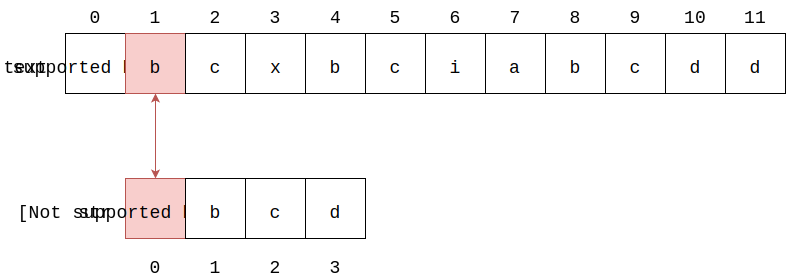
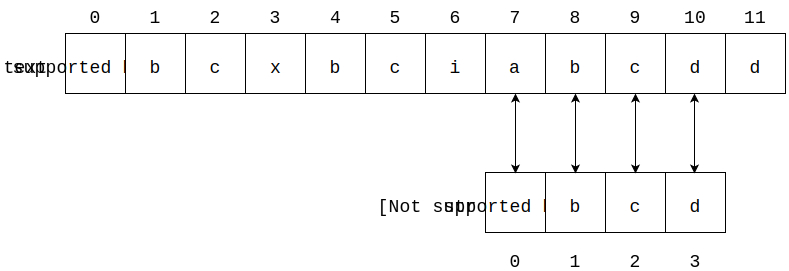

# Simple Match - 简单匹配

--------

#### 问题

在文本$$ text $$中查找字符串$$ str $$的位置（比如文本编辑器$$ VIM $$中查找某个字符串的场景，设$$ text $$长度为n，$$ str $$长度为$$ m $$，该场景满足$$ n \gt m $$）。

#### 解法

假设字符数组下标从$$ 1 $$开始。简单匹配的方法是对于$$ text[1 \cdots n] $$，从第$$ 1 $$个字符开始，依次比较$$ text[i+1 \cdots i+m] $$是否与$$ str[1 \cdots m] $$相等。若相等则$$ text[1 \cdots n] $$中匹配$$ str[1 \cdots m] $$的部分为$$ text[i+1 \cdots i+m] $$，否则继续从下一个位置$$ i+1 $$匹配。

实际大部分编程语言中字符数组的下标都从$$ 0 $$开始。下面演示一个匹配的过程：

$$ (1) $$ 从$$ text $$第$$ 0 $$个字符开始匹配，有$$ text[0 \cdots 2] = str[0 \cdots 2]，text[3] \ne str[3] $$，继续匹配下一个字符；

$$ (2) $$ 从$$ text $$第$$ 1 $$个字符开始匹配，有$$ text[1] \ne str[0] $$，继续匹配下一个字符；

$$
\cdots
$$

$$ (3) $$ 从$$ text $$第$$ 7 $$个字符开始匹配，$$ text[7 \cdots 10] = str[0 \cdots 3] $$，匹配成功，算法结束；

显然，对于$$ text $$中的每个位置$$ i $$，都需要进行一次匹配，而每次匹配的平均时间复杂度为$$ str $$的长度$$ m $$。因此该算法的时间复杂度为$$ O(m \times n) $$，实现简单但性能差。

--------

#### 源码

[import, lang:"c_cpp"](../../../src/TextMatch/SimpleMatch.hpp)

#### 测试

[import, lang:"c_cpp"](../../../src/TextMatch/SimpleMatch.cpp)
